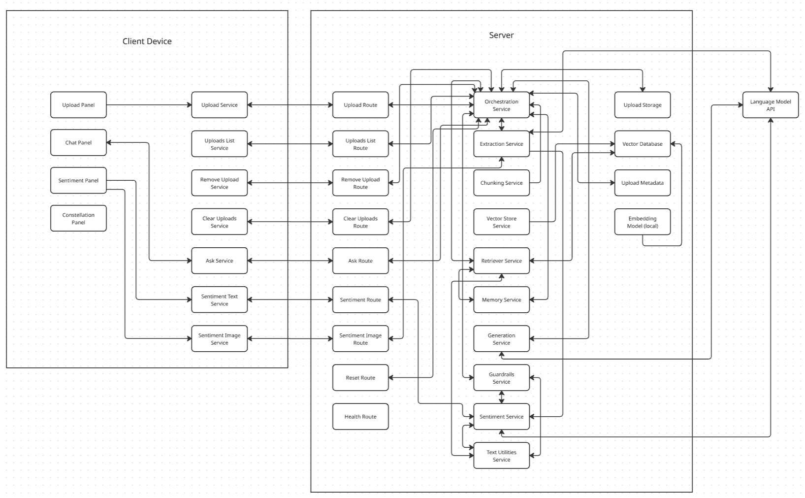

# Constellate

*a document search and explain assistant*

Constellate answers questions grounded in whatever documents you've
uploaded (PDFs, Word docs, plain text/markdown, and images or scanned
PDFs via OCR), citing its sources and saying so plainly when the answer
isn't in what's been uploaded.

The pipeline (upload, chunk, embed, retrieve, compose) is ported from a
sibling project, a university handbook chatbot, adapted for arbitrary
documents instead of one curated handbook: no scope gate, no
verbatim-quote-only mode, always composes an answer. An earlier direction
(a knowledge graph of entities and relationships across documents,
answering "how do these connect" rather than just "what does this say")
was tried first and dropped. See `services/orchestrator/README.md`'s
"What changed" section for the full reasoning: the model needed for
entity extraction was too slow to be usable.

## Architecture

Two pieces:

- **`services/orchestrator`**: the whole backend. FastAPI, one service,
  document upload and indexing, retrieval, and LLM-composed answers, all
  in one place (previously split across `orchestrator` and `ingestion`
  when the design was graph-based; see its README for why that split no
  longer applies).
- **`frontend`**: React chat UI (Vite). Wired to the orchestrator: upload
  a document, remove or clear uploads, ask a question, see the answer
  with citations and near-miss "related" sections. The "Connections used"
  graph panel is real constellations (Orion, Ursa Major, and others),
  picked and redrawn at random purely for brand decoration. No document
  data drives the shape itself, though the small gold labels on a few
  stars are drawn from the uploaded documents' own vocabulary once
  there's something to draw from.

LLM backend is NVIDIA's hosted NIM models (free tier, `build.nvidia.com`),
model `meta/llama-3.1-8b-instruct`. See
`services/orchestrator/app/llm.py`.

## Architecture Diagram



Every arrow is a real call verified against the source, not a sketch,
traced flow by flow: upload, ask, the four admin routes
(list/remove/clear/reset), and sentiment, which deliberately bypasses
Orchestration Service entirely rather than being routed through it like
everything else. Two boxes are correctly disconnected on purpose: Health
Route (a liveness check the frontend doesn't call today) and
Constellation Panel (decorative; it renders vocabulary already fetched by
Upload Service/Uploads List Service for other reasons, rather than
calling anything itself). The full write-up lives in
`docs/architecture.rst`.

## Status

Confirmed end-to-end on a real machine, not just traced by hand: upload
(including OCR via Tesseract, a separate binary from the Python
dependencies, see `services/orchestrator/README.md`'s "Running locally"),
chunking, embedding, retrieval, and LLM-composed answers all verified
working together against the real NVIDIA and Chroma endpoints.
`frontend` calls the orchestrator directly for every action (upload,
remove, clear, ask, list uploads), and both pieces have been run against
each other live.

Guardrails (`app/guardrails.py`) are live and have already caught a real
issue in practice, not just in tests: a hallucinated answer combining a
real document term with an invented one. The prompt and groundedness
checks have since been tightened against it; see
`services/orchestrator/README.md`'s "What changed" section.

Uploads persist across a backend restart (`data/uploads/`, gitignored;
see `services/orchestrator/README.md`'s "What changed" section), verified
with the real dependency stack, not just the stubbed-out Chroma used
during earlier development.

Automated tests now cover every layer, including the HTTP routes
themselves (`services/orchestrator/tests/test_main.py`, `test_sentiment.py`,
run against a live FastAPI `TestClient`), not just the logic underneath
them. What's still open: diagram-to-graph extraction only runs for PDFs.
A standalone image upload only ever gets flat OCR, with no structural
understanding of what connects to what.

Documentation (Sphinx, Furo theme) is live at
[constellate.readthedocs.io](https://constellate.readthedocs.io/en/latest/),
including the architecture diagram above and full API reference.

## Running locally

Both pieces need to be running at once, in two terminals.

Backend: see `services/orchestrator/README.md` for full setup (Python
venv, `NVIDIA_API_KEY`, `uvicorn --port 8001`).

Frontend:

```bash
cd frontend
npm install
cp .env.example .env   # optional -- only needed if the backend isn't on
                        # 127.0.0.1:8001
npm run dev
```

Open the URL Vite prints (usually `http://localhost:5173`). Upload a
document, then ask about it. If the backend isn't running, the upload/ask
actions will show an error banner rather than hanging silently.
